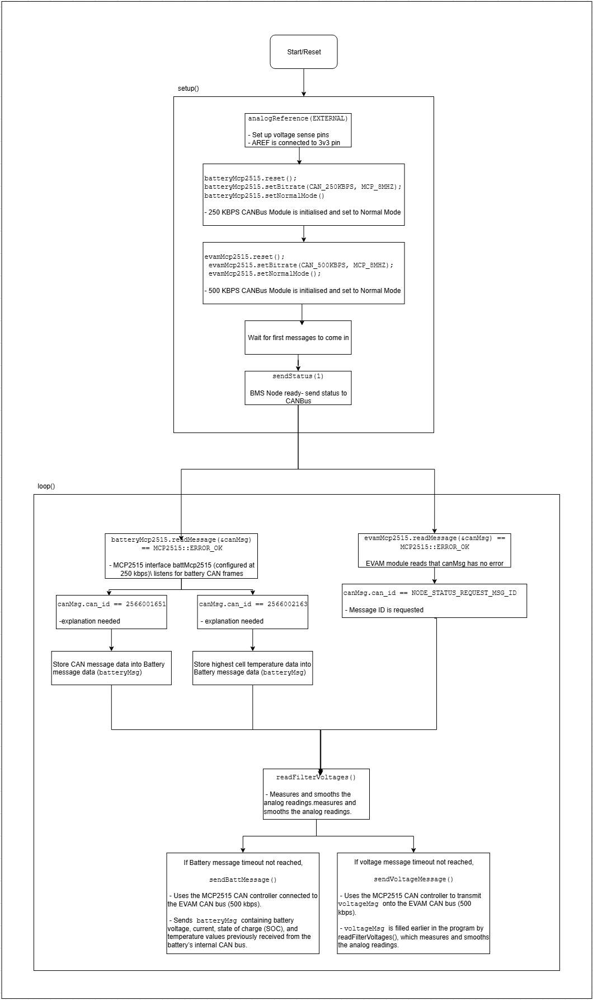

# Battery Management System (BMS)

This article aims to explain the firmware of the Battery Management System (BMS) node of the EVAM 1.0 CANBus 2 system.

## Background

The BMS node communicates with the traction battery's internal management system CAN bus and bridges that information to the EVAM's main CAN bus. 

It is a safety critical component with a recommended rating of ASIL-B at the minimum.

## General System Requirements

### System Requirements

The expected functions of the BMS node are as follows: 

1. Relay information from the traction battery's internal BMS CAN bus to the EVAM's main CAN bus. This information includes:
   - Battery voltage
   - Battery status
2. Relay the node's own status (where it is OK, offline or timeout)
3. Monitor the voltages of the 5V and the 12V rail and publishes this information to CANBus.

### System Interfaces

* **Interface 1 | Input | Battery CAN Bus interface**
    * Operates at 250kb/s
    * Receives battery status messages (CAN IDs: 0x99000013 and 0x99000053)
    * Data is decoded and stored into local CAN frame to be relayed to the EVAM CAN bus

* **Interface 2 | Output | EVAM CAN Bus**
    * Operates at 500kb/s
    * Periodically publishes:
        * Battery status
        * 5V and 12V rail voltages
        * Node status (OK, timeout, offline)
    * Responds to Node Status Requests (CAN ID: 0x07)

* **Interface 3 | Input | Voltage Sense Pins**
    * Analog inputs:
        * A0 for 5V rail
        * A1 for 12V rail
    * Uses external analog reference voltage (3.3V via AREF)
* Readings are filtered using an EWMA (Exponential Weighted Moving Average) algorithm for noise reduction

## Implementation

### Overall system description 

### Known Bugs

There are no known bugs spotted in the code as of yet.

## Improvements and future plans

* Add millis() overflow protection
