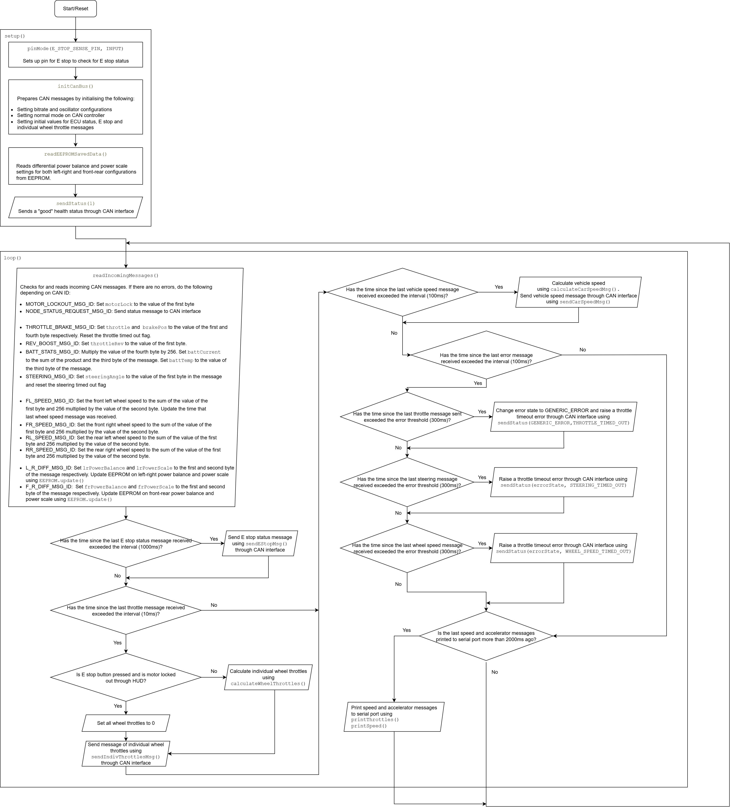

# Engine Control Unit (ECU)

This article aims to explain the design of the Engine Control Unit (ECU) subsystem in the EVAM 1.0 CANBus 2 system.

## Background

The Engine Control Unit (ECU) serves as the central computer that manages and coordinates key functions such as motor control, battery management and power distribution.

## General System Requirements

### System Requirements

The ECU runs on an Arduino Nano and the functions have been listed below.

1. The ECU should be able to read individual wheel speeds from wheel nodes and calculate vehicle speed; publish to CAN Bus. This is untested.
2. The ECU shall be able to read accelerator, steering and brake values, as well as other settings like reverse and boost and publish the results onto CAN Bus. This is untested.
3. The ECU shall be able to calculate individual throttle values for each wheel based on readings from the accelerator, steering and brakes and publish the results onto CAN Bus. This is untested.
4. The ECU shall be able to modify the power balance to the front-rear and left-right wheels based on steering angle, acceleration and throttle. This is untested.
5. The ECU shall be able to check if the E stop is pressed and publish the E stop status onto CAN Bus. This is untested.
6. A function that has not been implemented is the lowering of throttle amount if battery current is too high. This is to prevent the battery from being overloaded.
7. The ECU shall be able to detect if the E stop button is pressed and stop the vehicle in the event that the button is pressed. However, while the Arduino pin has been programmed, this function has __not__ been implemented

### System Interfaces

* **Interface 1 | Input/Output | Internal EEPROM**
    * ECU reads EEPROM from saved data. This contains information on the power balance and power scale from the individual wheels.
    * ECU updates EEPROM on the left-right and front-rear power balance and power scale values.
* **Interface 2 | Input/Output | CAN Bus**
    * ECU interfaces with the other nodes using CAN Bus interface.
    * CAN Bus frequency is set to 500Kb/s
* **Interface 3 | Input | E Stop Pin**
    * Digital Pin 3: Provides a 5V signal in the event that E-stop button is pressed and updates the E stop status. This status is checked by the ECU. **(Pin not used)**

## Implementation

### Overall System Description

### Known Bugs

There are no known bugs spotted in the code as of yet.

## Improvements and Future Plans

* Overflow Protection
    * Implement a safeguard against `millis()` overflow to prevent unintended behaviour.
* Unit Testing
    * Implement and verify correction mechanism for wheels if the power differential between either left-right or front-rear configurations are too large.
    * Currently, nothing can be done if a wheel is locked up as the brakes cannot be controlled. A correction mechanism should be implemented to address this scenario.
    * Ensure E stop message can be sent via CAN Bus through unit testing.
* Magic Constants in Status Check
    * Time intervals between sending messages and raising errors are arbitrarily set with little justification. If possible, provide a well-substantiated choice for the time intervals.
* Lack of EEPROM input validation
    * EEPROM data is read and used without any validation that the data appears to be correct. This is potentially very dangerous if the scaling factors from the EEPROM are completely wrong.
* E Stop Implementation
    * E Stop functions are not invoked which is very dangerous.