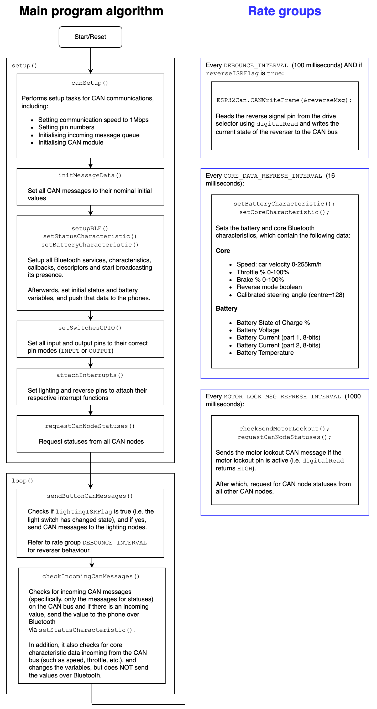

# Heads Up Display / Dashboard (HUD)

This article aims to explain the software design of the Heads Up Display (HUD) subsystem in the EVAM 1.0 CANBus 1 and 2 implementation.

## Background

The HUD subsystem is the largest subsystem of the electric vehicle, as it fuses all data from various sensors, connects to several dashboard switches and knobs, and presents them in a consistent manner to the driver. 

The current implementation in CANbus 1 and 2 uses a smartphone based screen, and therefore does not have its own screen hardware. This should preferably be changed due to the uncertain reliability of a wireless Bluetooth connection. 

The next generation CANbus 3 is intended to use a 6 to 7 inch OLED/LCD screen mounted to the vehicle just like a normal vehicle dashboard. In addition, wireless telemetry is also a good plus with the next generation CANbus 3 system. 

It is a safety critical component with a recommended rating of ASIL-B at the minimum.

## General System Requirements

### System Requirements

> This is where we put what the system is supposed to look like, what it is expected to do in the software. This section does NOT cover the software itself, just the requirements

The HUD node shall transmit Bluetooth messages based on the following:

* Status of CAN nodes
* Lighting data from BLE
* Motor wheel lock out
* Reverse mode
* Battery characteristics, which include the following:
    * State of charge (%)
    * Battery voltage
    * Battery current part 1 (8 bits)
    * Battery current part 2 (8 bits)
    * Battery Temperature
* Core characteristics, which include the following:
    * Speed: Car velocity (0-255 km/h)
    * Throttle % (0-100%)
    * Brake % (0-100%)
    * Reverse mode (0 or 1)
    * Calibrated steering angle (128 = centre)

For the full list of sender, receiver and message rate information, please see the [CAN Bus Messages excel sheet](/docs/References/CAN%20Bus%20Messages.xlsx).

### System Interfaces

> This describes how it interfaces with other parts. In our example of the TPS, it is fairly straightforward, there's only the voltage supply, CAN bus, and analog voltage converter that's connected to the pedal

* **Interface 1 | Input/Output | CAN bus interface**
    * HUD interfaces with the other nodes using its CAN bus interface
    * CAN bus frequency is set to 1000Kb/s
* **Interface 2 | Input/Output | Bluetooth**
    * Displays relevant information on the HUD

## Implementation

### Overall system description

> This describes the current implementation in software 

### Known Bugs

> This section contains all the known bugs spotted in the code

No known bugs are spotted in the code as of yet.

## Improvements and future plans

> What can be fixed/improved in the future (e.g. for CANBus 3.0)

* Error logging:
    * HUD does not log or report errors arising from other nodes, making it difficult to detect and correct errors.
* Bluetooth Connection:
    * HUD should not be displayed over bluetooth as interruptions to the bluetooth connection will cause the HUD to stop functioning.
* Eliminate usage of magic constants:
    * Many statements in code contains "magic constants", i.e. constants that are ill-defined or undocumented, resulting in difficulty in comprehension for anyone who is reviewing the code.