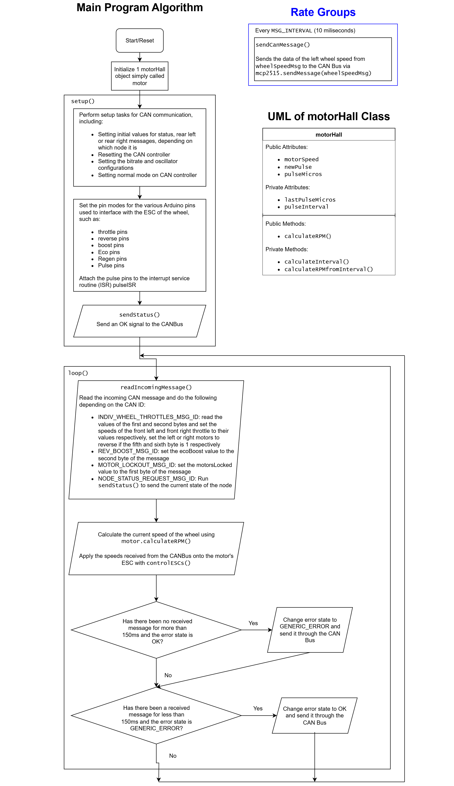

# Front Wheel Control

This article aims to explain the firmware of the two rear wheel (RW) nodes of the EVAM 1.0 CANBus 2 system. 

## Background

Each of the RW nodes controls the speed of one of the two rear wheels, with one node controlling the rear left wheel (RLW), and the other controlling the rear right wheel (RRW). Both of the nodes have almost identical codes, with the only difference being the CAN Bus ID that it responds to. 

This differs from the front wheel node, where one node interfaces with both front wheels. 

## General System Requirements

### System Requirements

The main purpose of the RW node is to receive CAN messages from the ECU node and change the speed of the rear wheel it controls accordingly. 

Depending on the received CAN ID, the node can also perform the following actions: boost the motors, turn on eco mode, lock the motors, reverse the direction and return its current error status. 

It will also periodically send CAN messages containing the current speed of each front wheel. The rate of transmission is 100Hz (10ms). 

In the event of an error, the node will automatically send an error message through the CANBus. Once the error is troubleshooted, it would send another CAN message stating the error has been resolved. 

### System Interfaces

* **Interface 1 | Input/Output | CAN bus interface**
    * RW interfaces with the other nodes using its CAN bus interface
    * CAN bus frequency is set to 500Kb/s

* **Interface 2 | Output | USB serial**
    * Prints debug messages at 115200 baud

* **Interface 3 | Input/Output | Motor ESC interface**
    * RW interfaces with the one of the rear motor ESCs with a 6 pin digital interface
    * Pulse / Digital Input D2: Detects pulses from the left motor which is used to calculate the motor speed
    * Acceleration or Throttle / Digital Output D5: Sends a PWM signal to the ESC throttle to control the speed of the left wheel
    * Reverse / Digital Output D7: Pin to control the direction of the motor, Active Low to trigger reverse direction
    * Boost / Digital Output D4: Activates the boost mode for the ESC to provide a sudden increase in speed, Active Low to trigger **(Pin not used)**
    * Eco / Digital Output D5: Activates the eco mode for the ESC to conserve energy usage, Active Low to trigger **(Pin not used)**
    * Lock / Digital Output D8: Electronic Lock for the ESC to prevent the car from moving, Active Low to trigger **(Pin not used)**

## Implementation

### Overall system description

### Known Bugs

No known bugs are spotted in the code as of yet.

## Improvements and future plans

* Implementation of Reverse, Eco Mode, Lock and Boost
    * The current firmware does not utilize the boost, eco mode, and lock pins of the ESC, and are currently set as floating pins. Future iterations may look into implementing these features. 
* Eliminate usage of magic constants:
    * Many statements in code contains "magic constants", i.e. constants that are ill-defined or undocumented, resulting in difficulty in comprehension for anyone who is reviewing the code.
* Misleading constant names
    * The name REGEN_PIN does not trigger regenerative braking, but rather motor lock. Nevertheless, both regen braking and motor lock is NOT implemented in the actual code.