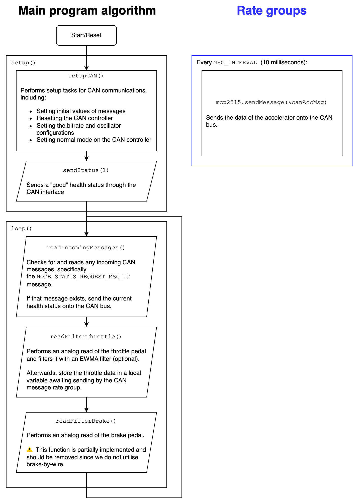

# Throttle Position Sensor (TPS)

This article aims to explain the software design of the Throttle Position Sensor (TPS) subsystem in the EVAM 1.0 CANBus 1 and 2 implementation.

## Background

The throttle position sensor is an essential part of the electric vehicle, that senses the position of the throttle pedal and transmits that data to the rest of the CAN bus nodes. 

It is a safety critical component with a recommended rating of ASIL-B at the minimum.

## General System Requirements

### System Requirements

> This is where we put what the system is supposed to look like, what it is expected to do in the software. This section does NOT cover the software itself, just the requirements

The TPS node shall frequently transmit the position of the throttle and brake pedals (optional) to the Engine Control Unit (ECU) and Heads Up Display (HUD) / Dashboard. The rate of transmission shall be 100 Hz (10ms period). 

The position of the throttle pedal can be optionally filtered by an exponential weighted moving average filter (EWMA), which smooths out the pedal signal. 

The TPS node shall also broadcast its "alive" status to all relevant nodes, to indicate its own health. Upon a health status change, it shall broadcast said change. 

While the TPS appears to account for a brake pedal for brake-by-wire, this is not implemented. Brake-by-wire is an ASIL-D critical system and should not be implemented casually.

For the full list of sender, receiver and message rate information, please see the [CAN Bus Messages excel sheet](/docs/References/CAN%20Bus%20Messages.xlsx).

### System Interfaces

> This describes how it interfaces with other parts. In our example of the TPS, it is fairly straightforward, there's only the voltage supply, CAN bus, and analog voltage converter that's connected to the pedal

* **Interface 1 | Input/Output | CAN bus interface**
    * TPS interfaces with the other nodes using its CAN bus interface
    * CAN bus frequency is set to 500Kb/s
* **Interface 2 | Output | USB serial**
    * Prints debug messages at 115200 baud
* **Interface 3 | Input | Analog to Digital pin A0**
    * Provides the ADC voltage from the throttle position sensor
    * Arduino Nano ADC provides a 10-bit value, but the expected range of this sensor (once digitized) should be around is between 0 and 1006, or between 0V and 5V
    * This input is checked for valid range (i.e. 0 to 1006). If it goes out of bounds excessively (exceeds bounds by a value of 50), the health status of the node changes and is broadcast to the rest of the nodes. If the input value is only slightly out of bounds (exceeds bounds, but not more than 50), the value is constrained to the minimum or maximum value 

## Implementation

### Overall system description

> This describes the current implementation in software 

### Known Bugs

> This section contains all the known bugs spotted in the code

No known bugs are spotted in the code as of yet.

## Improvements and future plans

> What can be fixed/improved in the future (e.g. for CANBus 3.0)

* Alive status broadcast redesign:
    * Nodes should broadcast its health status at a fixed interval of about 5 seconds, instead of upon every health state transition, as this ensures detection of node dropout (i.e. the node shuts down). Alternatively, health status should be determined by whether a node is still broadcasting its primary message (in our example, whether the TPS node is still broadcasting the throttle position data).
* Unit testing:
    * Computation functions, such as functions for sensor input validation, should be unit tested properly before actual implementation. This is to avoid undefined or unexpected behavior with different parameters. 
* Eliminate usage of magic constants:
    * Many statements in code contains "magic constants", i.e. constants that are ill-defined or undocumented, resulting in difficulty in comprehension for anyone who is reviewing the code. 

